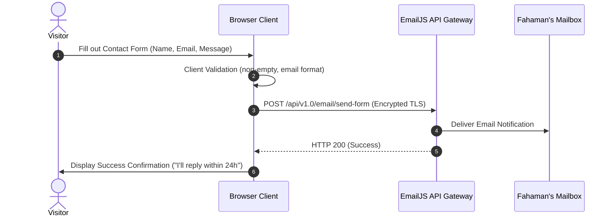

# Data Flow Architecture

```mermaid
sequenceDiagram
    autonumber
    actor User as Visitor
    participant Browser as Browser Client
    participant EmailJS as EmailJS API Gateway
    participant Mailbox as Fahaman's Mailbox

    User->>Browser: Fill out Contact Form (Name, Email, Message)
    Browser->>Browser: Client Validation (non-empty, email format)
    Browser->>EmailJS: POST /api/v1.0/email/send-form (Encrypted TLS)
    EmailJS->>Mailbox: Deliver Email Notification
    EmailJS-->>Browser: HTTP 200 (Success)
    Browser->>User: Display Success Confirmation ("I'll reply within 24h")
```
